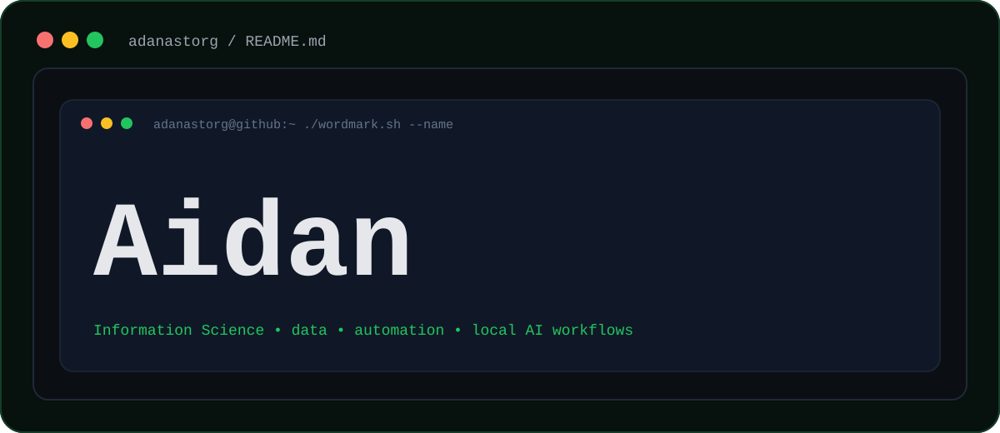

<div align="center">



<br />

[](https://github.com/adanastorg)


</div>

<br />

<table>
  <tr>
    <td width="60%">

```bash
adanastorg@github:~$ ./profile.sh --about
```

I'm **Aidan Danastorg**, an Information Science student building practical tools around data, automation, dashboards, local AI workflows, and everyday decision-making.

I like turning scattered information into something useful: cleaner notes, sharper dashboards, smarter trackers, and tools that help people move faster without losing the thread.

```bash
adanastorg@github:~$ status
```

```text
learning      text mining, information design, startup systems
building      local assistants, dashboards, tracking tools
exploring     health data, business systems, automation workflows
```

    </td>
    <td width="40%">


    </td>
  </tr>
</table>

---

<div align="center">

## `~/featured`

</div>

<table>
  <tr>
    <td width="50%">

### Agent Dashboard

```text
type      local web command center
stack     Python, agents, reports
focus     vault research + trading workflows
```

A browser-based dashboard for running local research agents and trading-analysis workflows from one place.

`repo: TODO`

    </td>
    <td width="50%">

### Calorie Tracker

```text
type      dependency-free browser app
stack     HTML, CSS, JavaScript
focus     calories, macros, workouts
```

A local-first tracker for meals, calories, macros, workout planning, and simple health-data logging.

`repo: TODO`

    </td>
  </tr>
  <tr>
    <td width="50%">

### Google Health to Codex MCP

```text
type      read-only local connector
stack     Python, OAuth, MCP
focus     steps, sleep, health metrics
```

A local connector pattern for exploring Google Health / Fitbit-style data from an assistant workflow.

`repo: TODO`

    </td>
    <td width="50%">

### QuickBooks Assistant Setup

```text
type      automation setup guide
stack     Node.js, MCP, QuickBooks Online
focus     reports, invoices, business systems
```

A sandbox-first setup for connecting QuickBooks Online to an AI assistant for small-business workflows.

`repo: TODO`

    </td>
  </tr>
</table>

---

<div align="center">

## `~/toolbox`


</div>

---

<table>
  <tr>
    <td width="33%">

```text
INTERESTS
---------
data dashboards
personal automation
text mining
```

    </td>
    <td width="33%">

```text
SYSTEMS
-------
local AI workflows
research tools
knowledge vaults
```

    </td>
    <td width="33%">

```text
BUSINESS
--------
startup systems
finance workflows
operations tooling
```

    </td>
  </tr>
</table>

---

<div align="center">

```bash
adanastorg@github:~$ echo "thanks for stopping by"
```

[](https://github.com/adanastorg)

`LinkedIn: TODO` &nbsp; | &nbsp; `Portfolio: TODO` &nbsp; | &nbsp; `Email: TODO`

</div>
